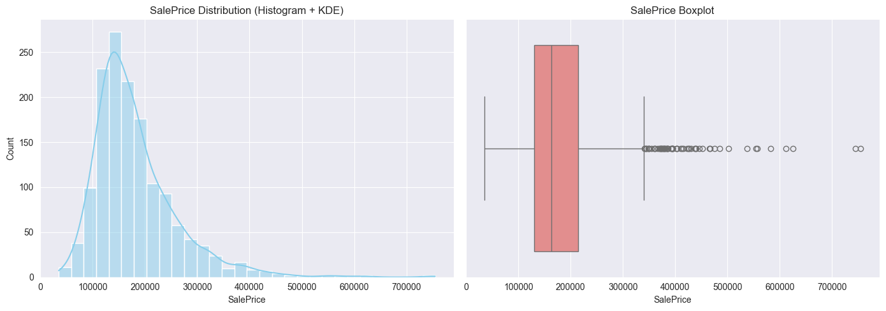
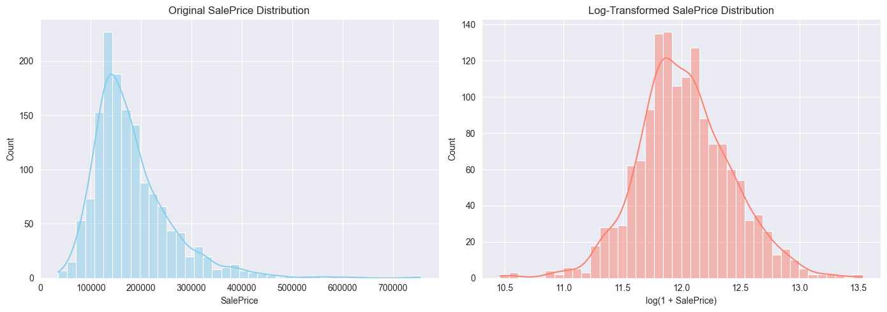
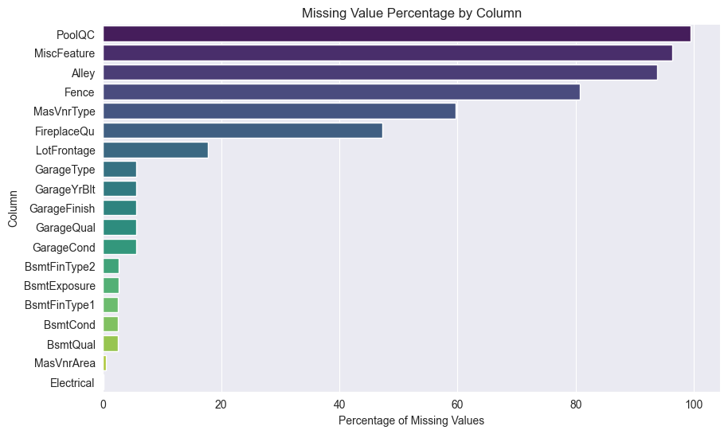
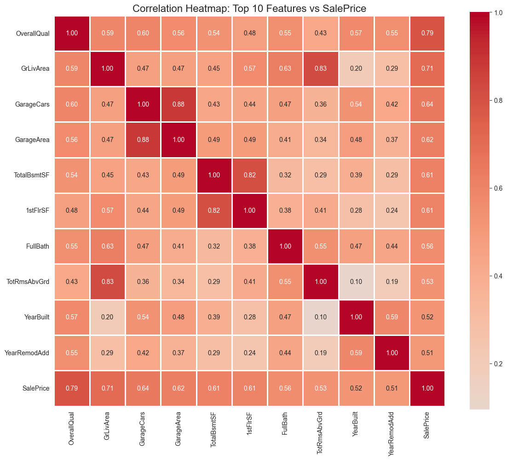

# 🏠 House Prices - Advanced Regression Techniques

<div align="center">


**Predicting house sale prices using neural networks and advanced feature engineering**

[🎯 Overview](#-project-overview) • [📊 Results](#-results) • [🚀 Quick-Start](#-quick-start) • [📦 Submission](#-kaggle-submission)

</div>

> Learning regression with neural networks — moving from classification to continuous predictions. Building on the Digit Recognizer project, now tackling feature engineering, missing data, and mixed data types.

---

## 👨‍💻 Author
<div align="center">

**Francisco Teixeira Barbosa**

[](https://github.com/Tuminha)
[](https://www.kaggle.com/franciscotbarbosa)
[](mailto:cisco@periospot.com)
[](https://twitter.com/cisco_research)

*Learning Machine Learning through CodeCademy • Building AI solutions step by step*

</div>

---

## 📍 Current Progress

**Status**: Phase 5 Complete ✅ | Ready for Phase 6 🚂

- ✅ **Phase 1: Environment Setup** - COMPLETE
  - Imported all ML/DL libraries (pandas, numpy, matplotlib, seaborn, PyTorch)
  - Loaded dataset (1,460 training samples, 1,459 test samples)
  - Analyzed data structure: 38 numerical + 43 categorical features
  
- ✅ **Phase 2: Exploratory Data Analysis** - COMPLETE
  - Analyzed target variable (SalePrice): heavily right-skewed (1.88)
  - Identified missing values: PoolQC (99%), Alley (94%), Fence (81%)
  - Found strongest predictors: OverallQual (0.79), GrLivArea (0.71), GarageCars (0.64)
  - Discovered multicollinearity: GarageArea/GarageCars (0.88)
  - Created 8 comprehensive visualizations
  
- ✅ **Phase 3: Data Preprocessing** - COMPLETE
  - Handled all missing values (numerical: median/0, categorical: 'None'/mode)
  - Created 5 engineered features (TotalSF, TotalBath, HouseAge, RemodAge, TotalPorchSF)
  - Removed 2 extreme outliers from training data
  - Applied log transformation to target (skewness: 1.88 → 0.12)
  - One-hot encoded 43 categorical features → 264 total features
  - Aligned train/test columns for consistency
  
- ✅ **Phase 4: Feature Scaling & Selection** - COMPLETE
  - Split data: 80-20 train-validation (1,166 / 292 samples)
  - Standardized all features (mean=0, std=1) using StandardScaler
  - Scaled train, validation, AND test sets consistently
  - Converted to PyTorch tensors (float32)
  - Data ready for neural network: 264 input features
  
- ✅ **Phase 5: Neural Network Architecture** - COMPLETE
  - Designed HousePricePredictor class (264→256→128→64→1)
  - Implemented dropout (0.2) for regularization
  - Single output neuron for regression (no activation)
  - MSELoss for regression task
  - Adam optimizer (lr=0.001)
  - Model complexity: 109,057 parameters
  
- 🔄 **Phase 6: Training Pipeline** - NEXT UP

---

## 🎯 Project Overview
- **What**: Predict house sale prices based on 79 explanatory features describing residential homes in Ames, Iowa
- **Why**: Learn regression with neural networks, master feature engineering, and handle real-world messy data with missing values
- **Expected Outcome**: Build a regression model achieving ~0.12-0.13 RMSE (log scale) and understand the difference between classification and regression

### 🎓 Learning Objectives
- Master regression with neural networks (vs classification)
- Handle missing data with proper imputation strategies
- Work with mixed data types (numerical + categorical)
- Implement feature engineering and selection
- Practice feature scaling and normalization
- Compare NN vs traditional ML (Linear Regression, Random Forest, XGBoost)
- Design output layers for continuous predictions

### 🏆 Key Achievements
- [x] Complete exploratory data analysis with visualizations
- [x] Identify strongest predictors (OverallQual, GrLivArea, GarageCars)
- [x] Discover data quality issues (missing values, skewness, multicollinearity)
- [x] Implement robust missing data handling strategy
- [x] Engineer features from 79 raw variables → 264 features
- [x] Apply log transformation to normalize target distribution
- [x] Scale features and convert to PyTorch tensors
- [x] Build PyTorch regression network (109K parameters)
- [ ] Train model and achieve <0.13 RMSE
- [ ] Achieve <0.13 RMSE on validation set
- [ ] Generate Kaggle submission
- [ ] Compare neural network vs traditional ML approaches

---

## 📊 Dataset / Domain
- **Source**: [Kaggle - House Prices: Advanced Regression Techniques](https://www.kaggle.com/c/house-prices-advanced-regression-techniques)
- **Training Size**: 1,460 samples
- **Test Size**: 1,459 samples
- **Features**: 79 (mix of numerical and categorical)
- **Target**: `SalePrice` - the property's sale price in dollars (continuous value)
- **Evaluation Metric**: RMSE between the logarithm of predicted and observed sale prices

---

## 📊 Data Flow Visualization

**NEW!** Complete data transformation pipeline documented!

### Quick Overview:
```
CSV Files (1460×81) → Preprocessing → Feature Engineering → 
One-Hot Encoding (264 features) → Scaling → Train/Val Split →
PyTorch Tensors → Neural Network → Predictions → Submission
```

**📄 [See Full Data Flow Diagram →](flowcharts/DATA_FLOW.md)**

The complete flowchart includes:
- ✅ Visual pipeline with all transformations
- ✅ Data shapes at every step (1460→1458→1166/292→264 features)
- ✅ Detailed explanations of key transformations
- ✅ Three datasets explained (train/validation/test)
- ✅ Feature evolution (79→264)
- ✅ Common confusions addressed

---

## 🚀 Quick Start
### Prerequisites
```bash
pip install -r requirements.txt
```

### Setup
```bash
git clone https://github.com/Tuminha/house-prices-prediction
cd house-prices-prediction

# Download data from Kaggle (see instructions below)
# Then run the notebook:
jupyter notebook notebooks/house_prices.ipynb
```

### 📥 Downloading the Dataset
1. Go to the [Kaggle competition page](https://www.kaggle.com/c/house-prices-advanced-regression-techniques/data)
2. Download `train.csv`, `test.csv`, and `sample_submission.csv`
3. Place them in the `data/` directory

**Or use Kaggle CLI:**
```bash
# First time setup (if not already done):
pip install kaggle
# Place your kaggle.json in ~/.kaggle/

# Download dataset:
kaggle competitions download -c house-prices-advanced-regression-techniques
unzip house-prices-advanced-regression-techniques.zip -d data/
```

---

## 📈 Project Phases
### Phase 1: Environment Setup ✅
<details>
<summary><strong>Details</strong></summary>

- [x] Import libraries (pandas, numpy, matplotlib, seaborn, torch, sklearn)
- [x] Check PyTorch version and device availability
- [x] Load training data from `data/` directory
- [x] Verify data loading and display basic information

</details>

### Phase 2: Exploratory Data Analysis (EDA) ✅
<details>
<summary><strong>Details</strong></summary>

- [x] Examine dataset shape and structure
- [x] Identify numerical vs categorical features (38 numerical, 43 categorical)
- [x] Analyze missing values (PoolQC 99%, Alley 94%, Fence 81%)
- [x] Visualize target variable (SalePrice) distribution (skewness = 1.88)
- [x] Correlation analysis with target (OverallQual: 0.79, GrLivArea: 0.71)
- [x] Identify top features correlated with SalePrice
- [x] Discover multicollinearity (GarageArea/GarageCars: 0.88)
- [x] Analyze categorical features (Neighborhood, OverallQual, HouseStyle)
- [x] Create 8 comprehensive visualizations

**Status: ✅ COMPLETE** | See [EDA Results](#-exploratory-data-analysis-results) section for detailed findings

</details>

### Phase 3: Data Preprocessing ✅
<details>
<summary><strong>Details</strong></summary>

- [x] Handle missing values with appropriate strategies
- [x] Created functions for numerical (median/0) and categorical ('None'/mode) imputation
- [x] Engineer 5 new features: TotalSF, TotalBath, HouseAge, RemodAge, TotalPorchSF
- [x] Remove 2 extreme outliers (GrLivArea > 4000 with low price)
- [x] One-hot encode all categorical variables (43 → 221 dummy features)
- [x] Align train/test columns (both now have 264 features)
- [x] Apply log transformation to target (normalized distribution)

**Status: ✅ COMPLETE**

**Final Dataset:**
- Features: 264 (38 numerical + 226 from one-hot encoding)
- Training samples: 1,458 (after outlier removal)
- Test samples: 1,459
- Target: Log-transformed (skewness reduced from 1.88 to ~0.12)

</details>

### Phase 4: Feature Scaling & Selection ✅
<details>
<summary><strong>Details</strong></summary>

- [x] Train/validation split (80/20) - 1,166 train / 292 validation
- [x] Standardize features using StandardScaler (mean=0, std=1)
- [x] Scale train, validation, AND test sets consistently
- [x] Convert to PyTorch tensors (float32)
- [x] Verify tensor shapes and data types

**Status: ✅ COMPLETE**

**Final Tensors:**
- X_train_tensor: (1,166 × 264) - Training features
- X_val_tensor: (292 × 264) - Validation features  
- test_tensor: (1,459 × 264) - Test features for Kaggle
- y_train_tensor: (1,166 × 1) - Training targets (log-transformed)
- y_val_tensor: (292 × 1) - Validation targets (log-transformed)

**Network Input Size**: 264 features

</details>

### Phase 5: Neural Network for Regression ✅
<details>
<summary><strong>Details</strong></summary>

- [x] Design regression network architecture (4 layers)
- [x] Implement dropout (0.2) for regularization
- [x] Use MSELoss for regression task
- [x] Initialize model with Adam optimizer (lr=0.001)
- [x] Count trainable parameters (109,057)

**Status: ✅ COMPLETE**

**Final Architecture:**
```
Input Layer:    264 features
Hidden Layer 1: 264 → 256 + ReLU + Dropout(0.2)
Hidden Layer 2: 256 → 128 + ReLU + Dropout(0.2)
Hidden Layer 3: 128 → 64  + ReLU
Output Layer:   64  → 1   (no activation)
```

**Model Specifications:**
- Total Parameters: 109,057
- Loss Function: MSELoss (Mean Squared Error)
- Optimizer: Adam (learning_rate=0.001)
- Regularization: Dropout(0.2) on layers 1 & 2
- Output: Single continuous value (house price prediction)

</details>

### Phase 6: Training Pipeline 🚂
<details>
<summary><strong>Details</strong></summary>

- [ ] Create DataLoaders for batching
- [ ] Implement training loop with validation
- [ ] Track MSE, MAE, RMSE, R² metrics
- [ ] Plot training curves
- [ ] Save best model based on validation RMSE

</details>

### Phase 7: Evaluation & Submission 📊
<details>
<summary><strong>Details</strong></summary>

- [ ] Evaluate model on validation set
- [ ] Generate predictions for test.csv
- [ ] Create submission.csv (Id, SalePrice)
- [ ] Submit to Kaggle
- [ ] Document model and results

</details>

---

## 📊 Exploratory Data Analysis Results

### Key Findings from Phase 2:

#### 🎯 Target Variable Analysis
- **Distribution**: Heavily right-skewed (skewness = 1.88)
- **Price Range**: $34,900 - $755,000
- **Median Price**: $163,000
- **Mean Price**: $180,921
- **Action Required**: Log transformation needed for neural network training

<div align="center">

<p><em>Original SalePrice distribution showing right skewness</em></p>
</div>

<div align="center">

<p><em>Log-transformed distribution (nearly normal with skewness ≈ 0.12)</em></p>
</div>

#### 🔍 Missing Values Analysis
- **PoolQC**: 99.5% missing (very few houses have pools)
- **Alley**: 93.8% missing (most houses don't have alley access)
- **Fence**: 80.8% missing (most houses don't have fences)
- **FireplaceQu**: 47.3% missing
- **LotFrontage**: 17.7% missing

<div align="center">

<p><em>Top features with missing values - strategic imputation needed</em></p>
</div>

#### 🏆 Strongest Predictors of Sale Price

| Feature | Correlation | Meaning |
|---------|-------------|---------|
| OverallQual | 0.79 | Overall material and finish quality |
| GrLivArea | 0.71 | Above grade living area (sq ft) |
| GarageCars | 0.64 | Size of garage in car capacity |
| GarageArea | 0.62 | Size of garage in square feet |
| TotalBsmtSF | 0.61 | Total square feet of basement area |
| 1stFlrSF | 0.61 | First floor square feet |
| FullBath | 0.56 | Full bathrooms above grade |
| TotRmsAbvGrd | 0.53 | Total rooms above grade |

<div align="center">

<p><em>Correlation heatmap showing relationships between top 10 features</em></p>
</div>

<div align="center">

<p><em>Scatter plots: OverallQual, GrLivArea, and GarageCars vs SalePrice</em></p>
</div>

#### ⚠️ Multicollinearity Detected
- **GarageArea ↔ GarageCars**: 0.88 correlation → Drop one feature
- **GrLivArea ↔ TotRmsAbvGrd**: 0.83 correlation → Consider dropping one
- **TotalBsmtSF ↔ 1stFlrSF**: 0.82 correlation → May keep both

#### 🏘️ Categorical Features Impact

<div align="center">

<p><em>Significant price variation across neighborhoods (NridgHt and NoRidge are premium)</em></p>
</div>

<div align="center">

<p><em>Clear linear relationship: Higher quality = Higher price</em></p>
</div>

<div align="center">

<p><em>2Story and 2.5Fin houses command premium prices</em></p>
</div>

---

## 🏆 Model Results
Coming soon after model training (Phase 6)!

### Expected Performance Benchmarks:
| Model | RMSE (Log) | Notes |
|-------|-----------|-------|
| Baseline (Mean) | ~0.40 | Just predict mean price |
| Linear Regression | ~0.14-0.16 | Simple baseline |
| Random Forest | ~0.13-0.14 | Traditional ML |
| Neural Network | ~0.12-0.13 | **Our target!** |
| XGBoost (tuned) | ~0.11-0.12 | Top models |

### 📌 Business Interpretation
*Coming soon - will interpret feature importance and key price drivers*

### 🖼 Visuals
*Visualizations will be added as the project progresses*

---

## 🛠 Technical Stack
| Component | Technology | Purpose |
|-----------|------------|---------|
| Data Processing | Pandas, NumPy | ETL & feature engineering |
| Visualization | Matplotlib, Seaborn | EDA & plots |
| ML Framework | PyTorch | Neural network regression |
| Traditional ML | Scikit-learn | Baselines & metrics |
| Development | Jupyter Notebook | Interactive learning |
| Version Control | Git/GitHub | Collaboration |

---

## 🤖 Trained Model
*Coming soon - will include model card, architecture details, and download link*

**Model Architecture:**
- Type: Feed-forward Neural Network for Regression
- Input Features: TBD (after feature engineering)
- Hidden Layers: 3 layers (256 → 128 → 64 neurons)
- Output: Single continuous value (predicted price)
- Regularization: Dropout (0.2)

---

## 📦 Kaggle Submission
The notebook includes Phase 7 to produce `submission.csv` for Kaggle.

### Generate Submission
```python
# Apply same preprocessing pipeline to test data
# Generate predictions
# Create submission file
submission = pd.DataFrame({
    'Id': test_ids,
    'SalePrice': predictions
})
submission.to_csv('submission.csv', index=False)
```

### Validate Submission
```python
import pandas as pd
s = pd.read_csv('submission.csv')
assert list(s.columns) == ['Id', 'SalePrice']
assert s.shape[0] == 1459
assert s['SalePrice'].notna().all()
print('✅ Submission looks valid:', s.shape)
```

### Upload to Kaggle
- **UI**: Kaggle → House Prices competition → Submit Predictions → upload `submission.csv`
- **CLI**: `kaggle competitions submit -c house-prices-advanced-regression-techniques -f submission.csv -m "Neural Network with feature engineering"`

---

## 📝 Learning Journey
**Key Skills Developed:**
- Regression vs Classification in Neural Networks
- Feature Engineering for Real Estate Data
- Missing Data Imputation Strategies
- Mixed Data Type Handling (Numerical + Categorical)
- Model Evaluation Metrics (RMSE, MAE, R²)
- PyTorch for Regression Tasks

---

## 🚀 Next Steps
- [ ] Implement ensemble methods (combine NN + XGBoost)
- [ ] Experiment with different architectures
- [ ] Add feature importance analysis
- [ ] Try advanced regularization techniques
- [ ] Compare with Gradient Boosting models
- [ ] Hyperparameter tuning with grid search

---

## 📄 License
MIT License (see [LICENSE](LICENSE))

<div align="center">

**⭐ Star this repo if you found it helpful! ⭐**  
*Building AI solutions one dataset at a time* 🚀

</div>

